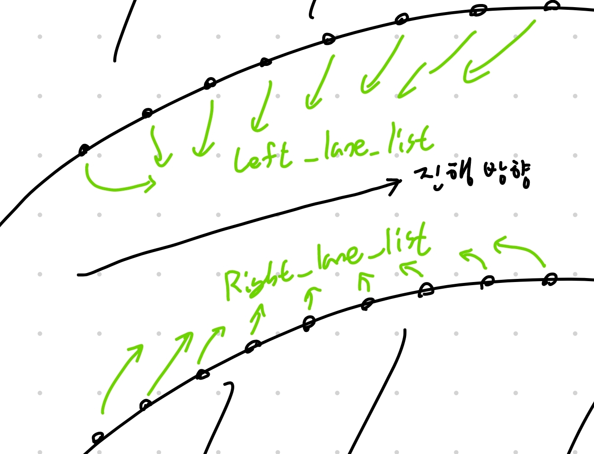

# 필요한 알고리즘 생각하기

## 맵은 어떻게 나타내야 하는가?
우선, 맵 데이터는 어떻게 들어오는지 알아야한다. 슬램의 경우 cloud point라 한다. 
우리가 필요한 맵은 그저 트랙의 왼쪽, 오른쪽 라인이다. 따라서 cloud point를 두 개의 list로 만드는 것이 좋다고 생각한다. 이를 통해 다루는 데이터의 양을 줄일 수 있다.    
이때, 두 개의 list는 왼쪽 line과 오른쪽 line을 동일한 간격으로 점을 찍고 그 좌표를 가지는 list이다.  
따라서, `cloudPntToList`함수를 만드는 것이 좋다고 생각한다.

## 격자화는 어떻게 하는가?
두번째로 우리는 맵을 격자로 만들어야한다. 이때 이 격자의 특징은 자동차의 진행방향에 수직(반드시 수직일 필요는 없음)인 직선들로 우선 잘려있고, 그 직선들이 몇 개의 점으로 나뉜다는 것이다.

우선 수직선을 그리는 알고리즘이 필요하다. 현재 생각한 알고리즘은 다음과 같다.

1. 어떤 수직선이 임의의 방법으로 주어져있다.
2. 그 수직선의 두 끝 점과 트랙 경계선의 접선을 그린다.
3. 접선의 오른쪽에 다른 트랙 경계선의 점들이 있으면 오른쪽 커브라고 판단한다. 반대면 왼쪽 커브.
4. 오른쪽 커브인 경우 왼쪽 트랙 경계선에서 이전 수직선과의 교점과 차량 진행방향으로 적당한 거리가 떨어진 한 점을 잡는다.
5. 잡은 한 점과 가장 가까운 반대편 트랙의 점을 잡고 그 점과 잇는 선을 수직선으로 잡는다.
6. 수직선을 중심점을 기준으로 짝수 개로 나눈다. 이떄 저장할 데이터는 그 직선을 나누는 점의 좌표.
7. 1번으로 돌아간다.
