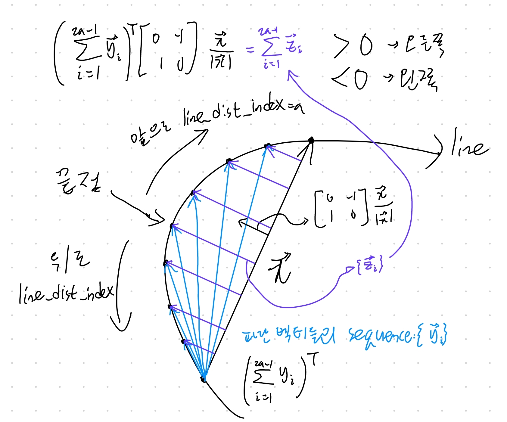

# 필요한 알고리즘 생각하기

## 맵은 어떻게 나타내야 하는가?
우선, 맵 데이터는 어떻게 들어오는지 알아야한다. 슬램의 경우 cloud point라 한다. 
우리가 필요한 맵은 그저 트랙의 왼쪽, 오른쪽 라인이다. 따라서 cloud point를 두 개의 list로 만드는 것이 좋다고 생각한다. 이를 통해 다루는 데이터의 양을 줄일 수 있다.    
이때, 두 개의 list는 왼쪽 line과 오른쪽 line을 동일한 간격으로 점을 찍고 그 좌표를 가지는 list이다.  
따라서, `cloudPntToList`함수를 만드는 것이 좋다고 생각한다.

일단 지금 짜야하는 코드는 최적경로를 찾는 코드이므로 이것은 다른 코드가 준다고 가정하고 짤 것이다. 따라서 여기서 짤 코드는 입력으로 두 list를 받을 것이다. 이것은 core에서 정의한다.

## 격자화는 어떻게 하는가?
두번째로 우리는 맵을 격자로 만들어야한다. 이때 이 격자의 특징은 자동차의 진행방향에 수직(반드시 수직일 필요는 없음)인 직선들로 잘려있고, 그 직선들이 몇 개의 점으로 나뉜다는 것이다.

우선 수직선을 그리는 알고리즘이 필요하다. 현재 생각한 알고리즘은 다음과 같다.

0. 수직선간 최대 거리를 인덱스의 개수로 치환하여 line_dist_index에 저장한다.
1. 어떤 오른쪽 라인위의 점 하나와 왼쪽 라인 위의 점 하나가 주어져있다.
2. 두 점은 첫 수직선을 대강 잡은 것으로 간주하고, 그 수직선이 왼쪽(오른쪽) 커브에 있다면 오른쪽(왼쪽) 점을 수직선의 끝점으로 사용하며 그 점에서 가장 가까운 왼쪽(오른쪽) 선 위의 점 하나를 첫 수직선의 다른 끝 점으로 잡는다. 이때 가까운 점을 찾는 범위는 대강 잡은 점 앞 뒤로 line_dist_index만큼의 영역이다.
3. 어떤 수직선의 끝 점 두 개가 주어져있다.
4. 그 끝점을 기준으로 왼쪽 커브와 오른쪽 커브를 구별한다. (아래 그림 참조)
    
    끝점의 앞과 뒤로 각각 line_dist_index만큼 내에 있는 점들로 판단한다.
5. 오른쪽 커브(왼쪽 커브)인 경우 왼쪽(오른쪽) 트랙 경계선에서 이전 수직선과의 끝점과 차량 진행방향으로 line_dist_index만큼 떨어진 한 점을 잡는다. 이때 새로 잡은 점의 인덱스가 라인의 길이를 초과하면 이 루프를 빠져나간다.
6. 잡은 한 점과 가장 가까운 반대편 트랙의 점을 잡고 새로 잡은 점과 잡았던 점 두 개를 끝점으로 가지는 선을 새로운 수직선으로 잡는다.
7. 3번으로 돌아간다.

만들어진 수직선을 통해 노드를 만든다. 노드는 수직선 위의 점들이다. 이는 각 수직선이 동일한 개수를 가지도록 한다. 이때 그 개수를 node_num_per_ver_line에 저장한다.

## 최적 경로는 어떻게 알아내는가?
위에서 주어진 노드들을 연결하는 최적의 경로를 생성한다.